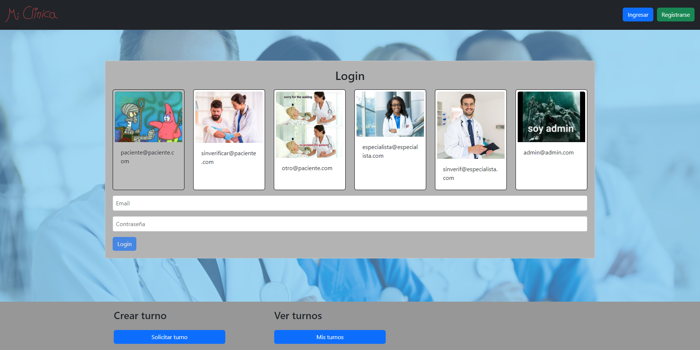
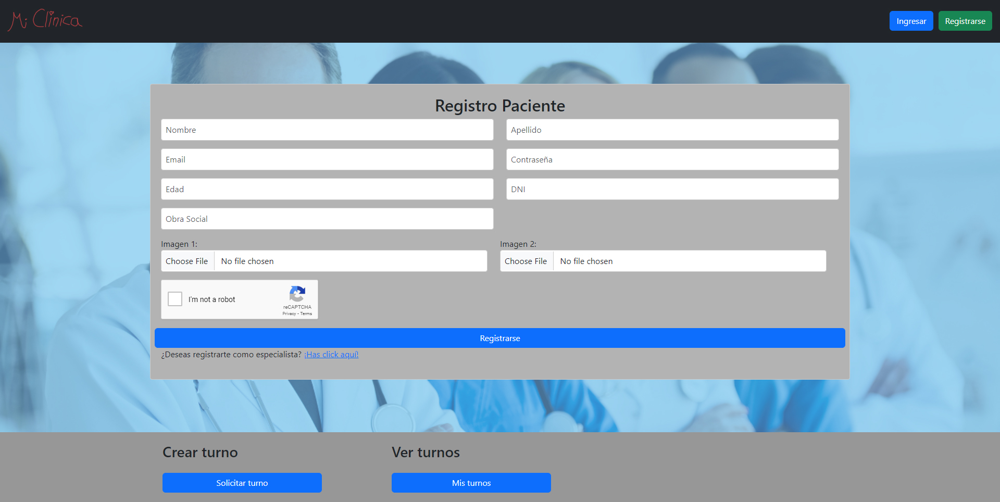
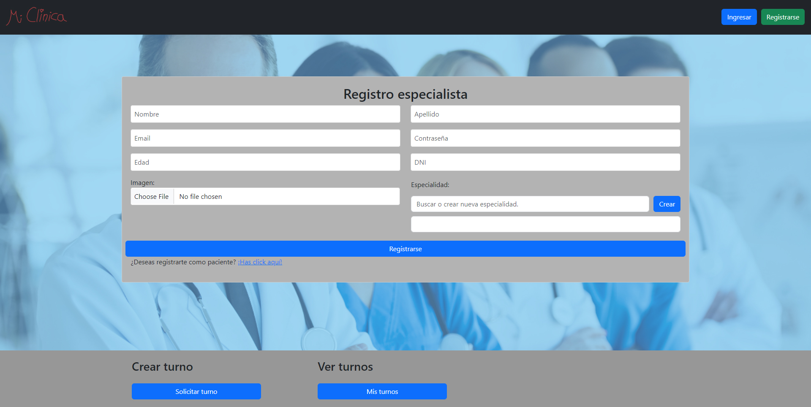
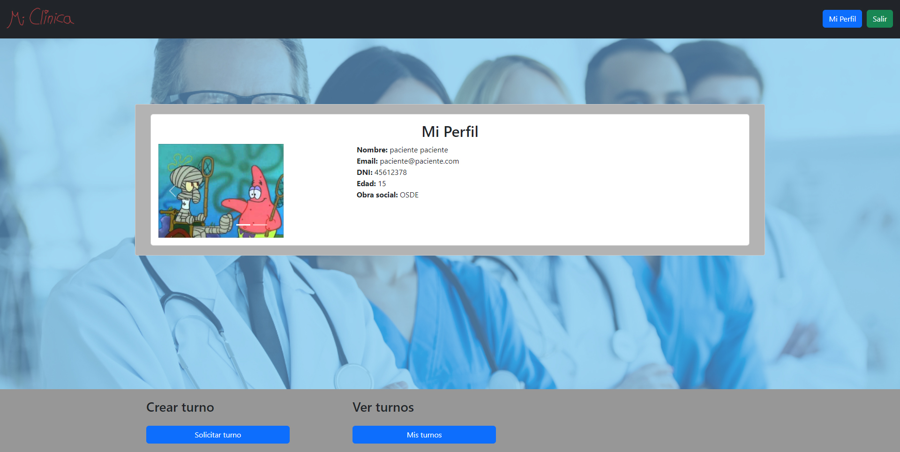
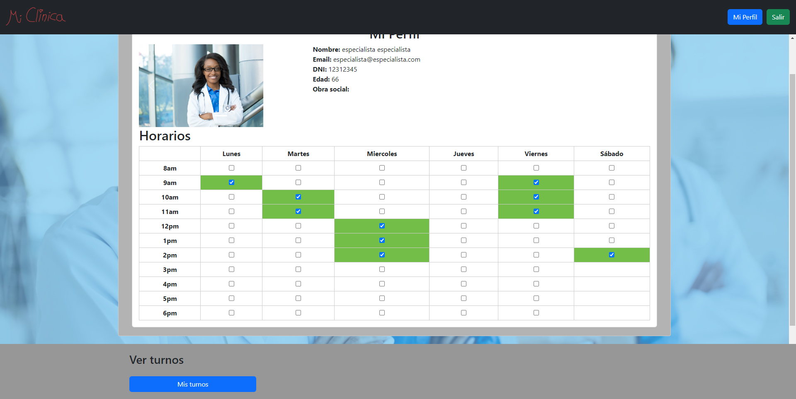
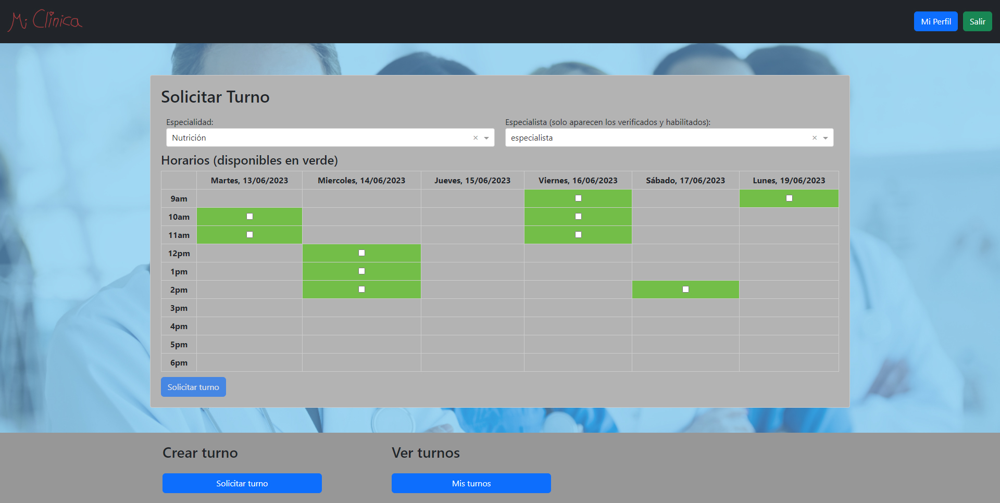
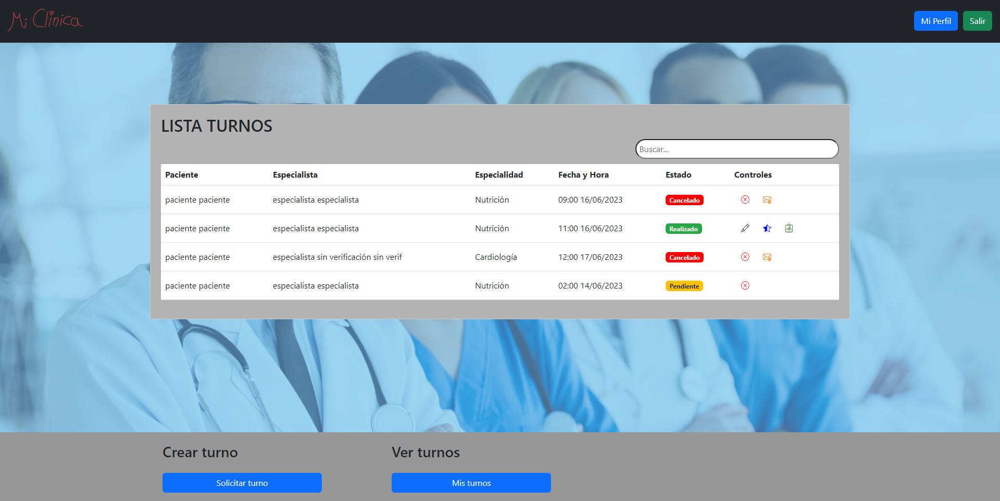
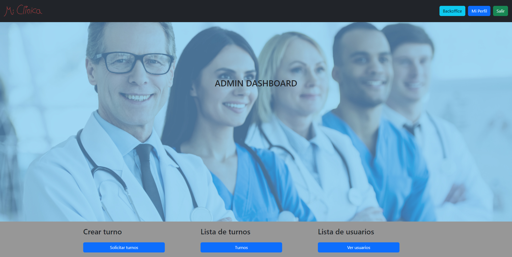
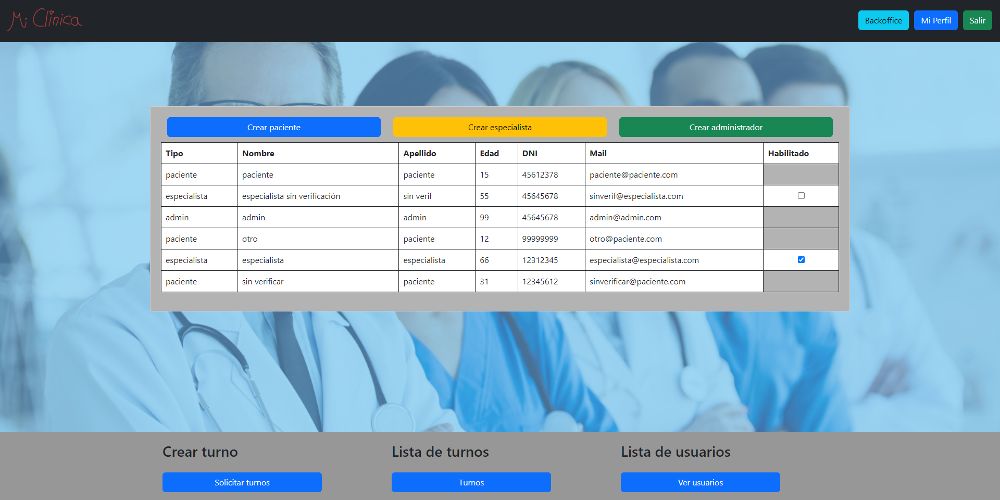

# Clinica

Este documento contiene la descripción y modo de utilizar la aplicación.

## Servidor de desarrollo

Si se desea correr la aplicación en modo de desarrollo se debe ejecutar el comando `ng serve` en la raíz del projecto y navegar a `http://localhost:4200/`.

# Sitio web

La aplicación está desplegada en este link [Clinica](https://clinica-9f1c7.web.app).

## Página principal

El home de la aplicación, dentro de esta se puede acceder a todas las secciónes que se desee.

# Autenticacíon

## Login

Desde esta pantalla el usuario puede ingresar sus credenciales para acceder al sistema.

## Registro

En esta seeción el usuario puede crear su cuenta, debe elegir el tipo de usuario que será (paciente o especialista) y completar los datos requeridos.

## Mi Perfil

Ingresando a través del botón en el navbar, uno puede acceder a los detalles de su perfil, ver sus fotos y sus datos, además los especialistas pueden modificar los horarios en los que se encuentran disponibles para sus turnos.

# Turnos

## Solicitar turno

Desde aquí el paciente o administrador puede crear turnos eligiendo el paciente (en caso del administrador), la especialidad, el especialista y la fecha y horario del turno.

## Ver turnos

El paciente, especialista o administrador puede ver los turnos que le corresponden y realizar acciones sobre los mismos.

# Admin

Los usuarios administradores pueden acceder al backoffice de la aplicación, donde se pueden controlar distintos aspectos de la misma.

## Lista de Usuarios

Los adminsitradores tienen acceso a la lista de usuarios completa de la aplicación.

